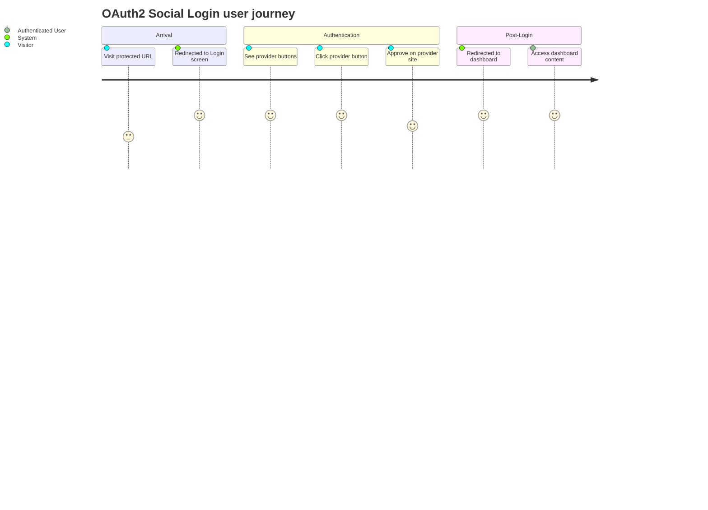

# Screens — OAuth2 Social Login

## Screen List

| Screen Name | SCR### | What User Sees | What User Can Do |
|-------------|--------|----------------|------------------|
| Login | TBD (draft) | Two social login buttons ("Continue with Facebook", "Continue with Twitter / X"); optional error message (on `?error`); optional logout confirmation (on `?logout`); application name/logo area | Click a provider button to begin OAuth2 flow; no form fields, no password entry |

## User Journey

1. User visits any protected application URL without a session and is redirected to the Login screen.
2. User sees the Login screen with two provider buttons; an error message is shown if a prior login attempt failed, or a confirmation if they just logged out.
3. User clicks "Continue with Facebook" or "Continue with Twitter / X" — the browser navigates to the chosen provider's authorization page.
4. User approves the authorization request on the provider's site and is redirected back to the application's OAuth2 callback URL.
5. The application processes the callback, upserts the user's account, and redirects the user to the dashboard home page (`/`).
6. If the provider returns an error or the user cancels, the user is returned to the Login screen with an error message.

