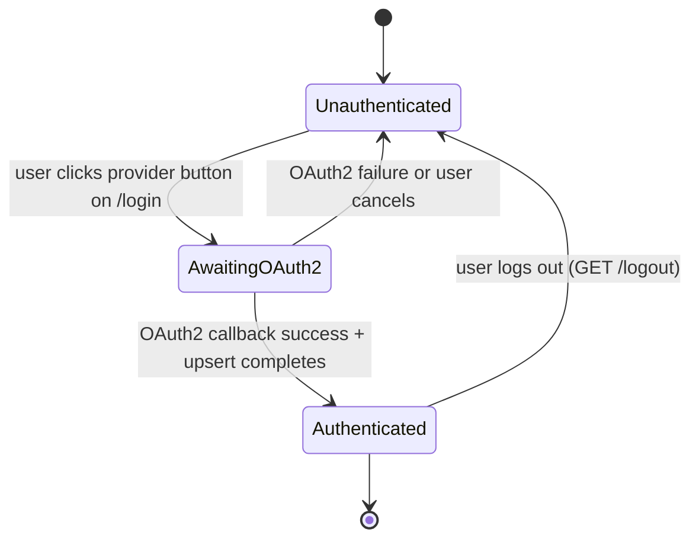

# F004_Oauth2SocialLogin

**Priority**: P0
**Type**: mixed
**Generated**: 2026-07-14

## Overview

OAuth2 Social Login enables visitors to authenticate with the Social Analytics Dashboard using their Facebook or Twitter/X accounts. On first login the system creates a local `User` record (with role USER — not the DB default ADMIN) and a linked `SocialAccount` that persists the OAuth2 access token; on subsequent logins the existing records are upserted. Successful authentication establishes a Spring Session and redirects to `/` (dashboard). The feature also installs a Spring Security filter chain that gates every application path — only `/login`, `/oauth2/**`, `/login/oauth2/**`, Swagger paths, and static assets are publicly accessible; everything else requires an authenticated session.

## Polymorphic Behavior

The `SocialAccount` entity carries a `provider` discriminator (`FACEBOOK` / `TWITTER`). The `User` entity carries a `role` enum (`ADMIN` / `USER`) whose DB default is `ADMIN` — the upsert MUST override this.

### DISC-001 — SocialAccount.provider

| Value | Render | Validation | Persistence |
|-------|--------|------------|-------------|
| FACEBOOK | Login page shows "Continue with Facebook" button; OAuth flow uses `CommonOAuth2Provider.FACEBOOK` built-in; user-info response is flat JSON (`id`, `name`, `email`) | Requires `public_profile,email` scope; `email` scope must be explicitly requested | `social_accounts.provider = 'FACEBOOK'`; `access_token` persisted; `refresh_token` nullable; `token_expires_at` nullable |
| TWITTER | Login page shows "Continue with Twitter / X" button; requires manual provider registration + PKCE (auto-enabled in Spring Security 7); user-info response is nested `{"data": {…}}` — must be unwrapped by custom `OAuth2UserService` | Requires `users.read,tweet.read,offline.access` scopes; `client-authentication-method: client-secret-post`; `user-name-attribute` must resolve to `data.id` | `social_accounts.provider = 'TWITTER'`; `access_token` persisted; `refresh_token` present if `offline.access` granted; `token_expires_at` nullable |

### DISC-002 — User.role

| Value | Render | Validation | Persistence |
|-------|--------|------------|-------------|
| USER | Normal authenticated experience; access to all permitted paths | Assigned explicitly during OAuth2 upsert — never derived from DB default | `users.role = 'USER'`; set in service layer at upsert time |
| ADMIN | Same as USER for this feature's scope (no admin-specific UI in D3) | Must not be auto-assigned via DB default when OAuth2 mints a new user — see BR-001 | `users.role = 'ADMIN'`; only reachable through out-of-band provisioning (not through social login) |

## Cross-Cutting Logic

### Requirements

| Code | Description | Endpoint/Handler | Verifiable |
|------|-------------|------------------|------------|
| FR-001 | All application paths except the permitted list require an authenticated session | Spring Security filter chain — `SecurityFilterChain` | yes |
| FR-002 | CSRF protection is enabled for all state-mutating requests; Thymeleaf forms auto-inject `_csrf` hidden field | Spring Security CSRF middleware | yes |
| FR-003 | Access tokens MUST NOT appear in application logs at any log level | Log configuration — no token fields logged | yes |
| FR-004 | Newly created `User` records MUST have `role = USER` regardless of the DB column default | `CustomOAuth2UserService.upsertUser()` | yes |

### Business Rules

#### BR-001_RoleAssignmentOnUpsert
**Linked FR:** FR-004
**Applies to:** `CustomOAuth2UserService.upsertUser()`
**Rule:** When creating a new `User` during OAuth2 upsert, `role` MUST be set explicitly to `UserRole.USER` in application code. The DB column default is `ADMIN` — relying on the default mints every social-login user as an admin, a critical security fail-open.

**Pseudocode:**
```pseudo
user = userRepository.findByEmail(email).orElseGet(() -> {
    User newUser = new User();
    newUser.setEmail(email);
    newUser.setName(name);
    newUser.setRole(UserRole.USER);   // EXPLICIT — never rely on DB default
    return userRepository.save(newUser);
});
```

#### BR-002_AccessTokenNeverLogged
**Linked FR:** FR-003
**Applies to:** `CustomOAuth2UserService`, any component receiving `OAuth2UserRequest`
**Rule:** The `accessToken` value from `userRequest.getAccessToken().getTokenValue()` MUST NOT be passed to any logger. It MUST NOT be stored in a field that Hibernate might trace via `org.hibernate.orm.jdbc.bind` at TRACE level.

**Pseudocode:**
```pseudo
// CORRECT
String token = userRequest.getAccessToken().getTokenValue();
socialAccount.setAccessToken(token);   // persists to DB
// WRONG
log.debug("Token: {}", token);         // FORBIDDEN
```

#### BR-003_SocialAccountUpsert
**Linked FR:** FR-001
**Applies to:** `CustomOAuth2UserService.upsertUser()`
**Rule:** `SocialAccount` is keyed on `(provider, providerAccountId)` — unique constraint `uk_provider_account`. On re-login, update `accessToken` (and `refreshToken`, `tokenExpiresAt` if present) in the existing row rather than creating a duplicate.

**Pseudocode:**
```pseudo
socialAccount = socialAccountRepo
    .findByProviderAndProviderAccountId(provider, providerUserId)
    .orElseGet(SocialAccount::new);
socialAccount.setUser(user);
socialAccount.setProvider(provider);
socialAccount.setProviderAccountId(providerUserId);
socialAccount.setAccessToken(accessToken);
socialAccountRepo.save(socialAccount);
```

#### BR-004_CsrfProtection
**Linked FR:** FR-002
**Applies to:** All state-mutating HTTP requests (POST, DELETE, PATCH)
**Rule:** CSRF token validation is enforced by the filter chain. Requests with a missing or tampered `_csrf` token receive HTTP 403. Thymeleaf `th:action` forms auto-inject the hidden `_csrf` input when `thymeleaf-extras-springsecurity6` is on the classpath. OAuth2 redirect callbacks on `/login/oauth2/callback/**` are exempted by Spring Security's default CSRF matcher (GET requests exempt by default).

**Pseudocode:**
```pseudo
// Spring Security default behavior — no code needed:
POST /some-endpoint without _csrf → 403 Forbidden
POST /some-endpoint with valid _csrf → passes to controller
GET /login/oauth2/code/facebook → exempt (GET, handled by filter chain)
```

#### BR-005_TokenEncryptionDeferred
**Linked FR:** FR-003
**Applies to:** `social_accounts.access_token`, `social_accounts.refresh_token`
**Rule:** Access and refresh tokens are stored in plaintext for D3. Encryption at rest (Jasypt or AES column encryption) is explicitly deferred to a later milestone. This is a known security gap — MUST be addressed before production deployment.

### Decision Logic

#### DEC-001_TwitterUserInfoUnwrap
**subtype:** flow
**Triggers in:** SCR-login — OAuth2 callback handling (server-side, no user interaction)
**Involved entities:** SocialAccount.provider, OAuth2User.attributes
**user_visible_outcome:** Twitter/X login succeeds or fails based on whether the nested `data` object is correctly unwrapped; an unwrap failure produces a login error redirect to `/login?error`
**Source:** TBD (draft) — CustomOAuth2UserService

```pseudo
if registrationId == "twitter":
    data = oAuth2User.attributes["data"]   // nested map
    providerUserId = data["id"]
    name = data["name"]
    return new DefaultOAuth2User(authorities, data, "id")
else:  // facebook — flat response
    providerUserId = oAuth2User.getAttribute("id")
    name = oAuth2User.getAttribute("name")
```

#### DEC-002_PostLoginRedirect
**subtype:** flow
**Triggers in:** SCR-login — OAuth2 success callback
**Involved entities:** User (new vs returning)
**user_visible_outcome:** Authenticated user is redirected to `/` (dashboard); authentication failures redirect to `/login?error` with error message displayed
**Source:** TBD (draft) — SecurityConfig.authenticationSuccessHandler / authenticationFailureHandler

```pseudo
on OAuth2 success:
    response.sendRedirect("/")
on OAuth2 failure:
    response.sendRedirect("/login?error")
```

### State Machines

#### SM-001_AuthenticationSessionLifecycle
**kind:** entity
**Linked FR:** FR-001



**Transition rules:**
- `Unauthenticated → AwaitingOAuth2`: guard = user navigates to `/oauth2/authorization/{provider}`
- `AwaitingOAuth2 → Authenticated`: guard = provider returns valid authorization code; `CustomOAuth2UserService.loadUser()` completes without exception; upsert succeeds
- `AwaitingOAuth2 → Unauthenticated`: guard = provider error response OR `OAuth2AuthenticationException` thrown; redirect to `/login?error`
- `Authenticated → Unauthenticated`: guard = logout request processed; session invalidated; redirect to `/login?logout`

### Algorithms

None.

### External Integrations

#### INT-001_FacebookOAuth2
**Linked FR:** FR-001
**Type:** api-call
**Target:** Facebook Graph API (`https://www.facebook.com/v18.0/dialog/oauth`, `https://graph.facebook.com/me`)
**Trigger:** User initiates login via "Continue with Facebook" button
**Payload:** `client_id`, `redirect_uri`, `scope=public_profile,email`, `state` (CSRF nonce managed by Spring Security)
**Failure handling:** Provider error → Spring Security catches `OAuth2AuthenticationException`; `AuthenticationFailureHandler` redirects to `/login?error`

**Pseudocode:**
```pseudo
// Spring Security handles the full flow automatically:
// 1. Redirect to FB authorization URI with scope + state
// 2. FB returns code to /login/oauth2/code/facebook
// 3. Spring exchanges code for token at token-uri
// 4. Spring fetches user-info at user-info-uri
// 5. loadUser() is called → upsert → session established
```

#### INT-002_TwitterXOAuth2
**Linked FR:** FR-001
**Type:** api-call
**Target:** Twitter/X API v2 (`https://x.com/i/oauth2/authorize`, `https://api.twitter.com/2/oauth2/token`, `https://api.twitter.com/2/users/me`)
**Trigger:** User initiates login via "Continue with Twitter / X" button
**Payload:** `client_id`, `redirect_uri`, `scope=users.read tweet.read offline.access`, `code_challenge` + `code_challenge_method=S256` (PKCE — auto-generated by Spring Security 7), `state`
**Failure handling:** Same as Facebook — `AuthenticationFailureHandler` redirects to `/login?error`; nested-data unwrap failure surfaces as `OAuth2AuthenticationException`

**Pseudocode:**
```pseudo
// PKCE flow (Spring Security 7 — auto-enabled):
// 1. Generate code_verifier + code_challenge
// 2. Redirect to X authorization URI
// 3. X returns code to /login/oauth2/code/twitter
// 4. Exchange code + code_verifier for token (client-secret-post)
// 5. Fetch /2/users/me with Bearer token
// 6. Unwrap nested {"data": {…}} in loadUser()
```

### Verification

- **SC-001** — Unauthenticated GET `/posts` redirects to `/login` (covers FR-001)
- **SC-002** — POST to any protected endpoint without valid CSRF token returns 403 (covers FR-002)
- **SC-003** — After successful OAuth2 mock login, `users` table contains new row with `role = 'USER'` (covers FR-004, BR-001)
- **SC-004** — No access token value appears in application log output at any level (covers FR-003, BR-002)
- **SC-005** — Second login with same provider account updates existing `social_accounts` row rather than inserting duplicate (covers BR-003)

---

**Client behavior:** see
[`behavior-logic.md`](../../docs/system/behavior-logic.md) (client-side patterns — debounce, optimistic UI, polling, upload, realtime),
[`permissions.md`](../../docs/system/permissions.md) (feature flags / experiments / env / locale gates),
[`architecture.md`](../../docs/system/architecture.md) (guards / deep-link state restoration / unsaved-changes protection).

## User Stories

### US001_SocialLoginInitiation — Social Login Page Presentation (Priority: P0)

**What happens:** An unauthenticated visitor navigates to any protected URL (or directly to `/login`) and sees the login page with two provider buttons — "Continue with Facebook" and "Continue with Twitter / X". No username/password form exists.
**Why this priority:** Gateway to the entire application — without it no user can access any feature.
**Independent Test:** Navigate to `/login` without a session; confirm two OAuth2 provider buttons render and each links to the correct Spring Security OAuth2 authorization endpoint.

**Acceptance Scenarios:**

1. **Given** no active session, **When** a visitor navigates to any protected path (e.g., `/posts`), **Then** Spring Security redirects them to `/login`.
2. **Given** the login page renders, **When** the visitor inspects the page, **Then** two buttons labeled "Continue with Facebook" and "Continue with Twitter / X" are visible; clicking Facebook initiates `/oauth2/authorization/facebook`; clicking Twitter initiates `/oauth2/authorization/twitter`.
3. **Given** a failed prior login attempt (URL contains `?error`), **When** the login page renders, **Then** an error message ("Login failed. Please try again.") is displayed above the buttons.
4. **Given** a prior logout (URL contains `?logout`), **When** the login page renders, **Then** a logout confirmation message is displayed.

**Requirements fulfilled:**
- **FR-001** All protected paths redirect unauthenticated requests to `/login` — Spring Security `SecurityFilterChain` via `authorizeHttpRequests()`
- **FR-005** Login page is publicly accessible at `/login` — `requestMatchers("/login").permitAll()`

**Rules enforced:** None specific to page rendering.

**Verification:**
- **SC-006** — GET `/login` with no session returns HTTP 200 (covers FR-005)
- **SC-007** — GET `/posts` with no session returns 302 redirect to `/login` (covers FR-001)

---

### US002_FacebookOAuth2Login — Facebook Login and User Upsert (Priority: P0)

**What happens:** A visitor clicks "Continue with Facebook", is redirected through the Facebook OAuth2 flow, and upon returning with a valid authorization code the system upserts a `User` (role=USER) and a `SocialAccount` (provider=FACEBOOK), establishes a session, and redirects to `/`.
**Why this priority:** Core authentication path for the primary provider.
**Independent Test:** Use `@WebMvcTest` with `oauth2Login()` post-processor simulating a Facebook authentication token; confirm `/` returns 200 and the `User` + `SocialAccount` records exist with correct values.

**Acceptance Scenarios:**

1. **Given** visitor clicks "Continue with Facebook", **When** Facebook redirects back with a valid code, **Then** `CustomOAuth2UserService.loadUser()` is called, a `User` row is created/updated with `role=USER`, a `SocialAccount` row is created/updated with `provider=FACEBOOK`, and the user is redirected to `/`.
2. **Given** an existing user returns (same Facebook account ID), **When** they complete the OAuth2 flow again, **Then** the existing `User` row is reused and the `SocialAccount.accessToken` is updated in place — no duplicate rows.
3. **Given** Facebook returns an error (e.g., user denies permissions), **When** the error callback arrives, **Then** `AuthenticationFailureHandler` redirects to `/login?error` and the error message is displayed.

**Requirements fulfilled:**
- **FR-006** `CustomOAuth2UserService` extracts `id`, `name` from flat Facebook user-info response — `GET https://graph.facebook.com/me?fields=id,name,email`
- **FR-007** New `User` records are persisted with `role=USER` (explicit override of DB default) — `UserRepository.save()`
- **FR-008** `SocialAccount` record is upserted keyed on `(FACEBOOK, providerAccountId)` — `SocialAccountRepository.findByProviderAndProviderAccountId()`

**Rules enforced:**
- BR-001_RoleAssignmentOnUpsert (see Cross-Cutting Logic)
- BR-002_AccessTokenNeverLogged (see Cross-Cutting Logic)
- BR-003_SocialAccountUpsert (see Cross-Cutting Logic)

**Verification:**
- **SC-001** (see Cross-Cutting Logic)
- **SC-003** (see Cross-Cutting Logic)
- **SC-005** (see Cross-Cutting Logic)

---

### US003_TwitterOAuth2Login — Twitter/X Login and User Upsert (Priority: P0)

**What happens:** A visitor clicks "Continue with Twitter / X", completes the PKCE-enabled OAuth2 flow against Twitter API v2, and upon returning the system unwraps the nested `{"data": {…}}` response, upserts `User` + `SocialAccount` (provider=TWITTER), establishes a session, and redirects to `/`.
**Why this priority:** Second required provider per feature scope.
**Independent Test:** Use `oauth2Login()` post-processor with Twitter registration id and attributes simulating the unwrapped `data` map; confirm session established and DB records correct.

**Acceptance Scenarios:**

1. **Given** visitor clicks "Continue with Twitter / X", **When** Twitter redirects back with a valid authorization code, **Then** Spring Security exchanges code+verifier for a token (PKCE), fetches `/2/users/me`, the custom service unwraps `attributes["data"]`, upserts `User` and `SocialAccount` (provider=TWITTER), and redirects to `/`.
2. **Given** same Twitter account re-authenticates, **When** the OAuth2 flow completes, **Then** existing `SocialAccount` row is updated with fresh `accessToken` — no duplicate.
3. **Given** Twitter returns an error or the nested-data unwrap fails with a `ClassCastException`, **When** the exception is caught as `OAuth2AuthenticationException`, **Then** user is redirected to `/login?error`.

**Requirements fulfilled:**
- **FR-009** Manual Twitter provider registration in `application.yml` with PKCE (auto-enabled in Spring Security 7)
- **FR-010** `CustomOAuth2UserService` detects `registrationId == "twitter"` and unwraps `attributes.get("data")` map before extracting `id` and `name`
- **FR-011** Returns a new `DefaultOAuth2User` with flattened `data` map and `user-name-attribute = "id"`

**Rules enforced:**
- BR-001_RoleAssignmentOnUpsert, BR-002_AccessTokenNeverLogged, BR-003_SocialAccountUpsert (see Cross-Cutting Logic)
- DEC-001_TwitterUserInfoUnwrap (see Cross-Cutting Logic)

**Verification:**
- **SC-008** — Twitter mock login produces `SocialAccount` with `provider=TWITTER` and no ClassCastException (covers FR-010, FR-011)

---

### US004_ProtectedRouteEnforcement — Whole-App Authentication Gate (Priority: P0)

**What happens:** Every HTTP request to any path not in the permitted list is intercepted by the Spring Security filter chain and requires an authenticated session. Unauthenticated requests are redirected to `/login`; authenticated requests pass through to the controller layer.
**Why this priority:** Without this, all existing REST endpoints remain public — the security requirement is broken.
**Independent Test:** `@WebMvcTest` with `@Import(SecurityConfig.class)`: confirm unauthenticated GET `/posts` → 302 to `/login`; authenticated GET `/posts` → 200.

**Acceptance Scenarios:**

1. **Given** no active session, **When** GET `/posts` is requested, **Then** Spring Security returns 302 redirect to `/login`.
2. **Given** an active session, **When** GET `/posts` is requested, **Then** the controller handles the request normally.
3. **Given** any request to `/swagger-ui/**`, `/v3/api-docs/**`, `/oauth2/**`, `/login/oauth2/**`, `/login`, or static assets (`/css/**`, `/js/**`, `/images/**`, `/webjars/**`, `/error`), **When** made without a session, **Then** the request is permitted through without redirect.

**Requirements fulfilled:**
- **FR-001** Security filter chain applied to all paths (covers all US)
- **FR-012** Swagger and API docs paths are permitted without authentication

**Rules enforced:** None additional.

**Verification:**
- **SC-007** (see US001)
- **SC-009** — GET `/swagger-ui/index.html` without session returns 200 (covers FR-012)

---

### US005_LogoutFlow — Session Termination (Priority: P1)

**What happens:** An authenticated user triggers logout (navigates to `/logout` via a logout button/link in the app). Spring Security invalidates the session and redirects to `/login?logout`.
**Why this priority:** Required for complete auth lifecycle; lower than login itself.
**Independent Test:** Authenticated session + GET `/logout` → 302 to `/login?logout`; confirm session cookie is cleared.

**Acceptance Scenarios:**

1. **Given** an authenticated session, **When** the user navigates to `/logout`, **Then** the session is invalidated and the user is redirected to `/login?logout`.
2. **Given** the login page with `?logout` parameter, **When** the page renders, **Then** a logout confirmation message is displayed.

**Requirements fulfilled:**
- **FR-013** Logout endpoint at `/logout` invalidates session and redirects to `/login?logout` — Spring Security `logout()` DSL

**Rules enforced:** None additional.

**Verification:**
- **SC-010** — GET `/logout` with authenticated session → 302 to `/login?logout`; subsequent GET `/posts` → 302 to `/login` (covers FR-013)

## Key Entities

| Entity | Table | Key Columns | Purpose |
|--------|-------|-------------|---------|
| User | `users` | `id`, `email` (UNIQUE NOT NULL), `name`, `avatar_url`, `role` (UserRole enum, DB default ADMIN — must be overridden), `created_at`, `updated_at` | Created/updated on first and subsequent OAuth2 logins; `role` MUST be explicitly set to USER by service layer |
| SocialAccount | `social_accounts` | `id`, `user_id` (FK), `provider` (SocialProvider enum: FACEBOOK/TWITTER), `provider_account_id`, `access_token` (TEXT NOT NULL), `refresh_token` (nullable), `token_expires_at` (nullable), `created_at` | Keyed on `(provider, provider_account_id)` unique constraint; upserted on every login; stores OAuth2 tokens |
| Spring Session | (in-memory / HTTP session) | session cookie (JSESSIONID) | Server-side session established after successful OAuth2 authentication; invalidated on logout |

## Artifact References

| Artifact | File | Codes Used | Reviewed |
|----------|------|------------|----------|
| System Overview | [system-overview.md](../../docs/system/system-overview.md) | — | [ ] |
| Architecture | [architecture.md](../system/architecture.md) | — | [ ] |
| Feature List | [feature-list.md](../../docs/generated/feature-list.md) | TBD (draft) | [ ] |
| API Map | [api-map.md](../../docs/generated/api-map.md) | TBD (draft) | [ ] |
| Entities | [entities.md](../../docs/generated/entities.md) | TBD (draft) | [ ] |
| Screens | [screens.md](./screens.md) | TBD (draft) | [ ] |
| Permissions | [permissions.md](../system/permissions.md) | TBD (draft) | [ ] |
| User Stories | [user-stories.md](../../docs/generated/user-stories.md) | TBD (draft) | [ ] |

## Assumptions

- Spring Session uses the default in-memory `HttpSessionCsrfTokenRepository`; no Redis or JDBC session store is required for D3 scope.
- The DB `users.role` column default is `ADMIN` (as designed in `database-design.md`) — this is a documented fail-open trap; the service layer MUST always set `role = USER` explicitly for social-login-created users.
- Token encryption at rest (Jasypt/AES) is deferred beyond D3; the spec records this deferral explicitly per BR-005.
- `thymeleaf-extras-springsecurity6` version compatibility with Spring Security 7 is handled by Spring Boot 4.1 BOM — must be verified at build time (`mvn dependency:tree`).
- `CommonOAuth2Provider.FACEBOOK` embeds a specific Graph API version (v18 based on research); this may lag Facebook's deprecation schedule — pinning may be needed if the built-in URI becomes invalid.
- Twitter/X `client-authentication-method: client-secret-post` is assumed correct for confidential server-side apps; must be verified against X's current token endpoint behavior.
- The `/` path is the post-login redirect target; no dashboard controller/template exists yet (D4/D5 scope) — a 404 or placeholder response is acceptable for D3.
- `UserRepository.findByEmail()` and `SocialAccountRepository.findByProviderAndProviderAccountId()` are confirmed to exist in the current codebase (scout report).
- Placeholder OAuth2 client-ids (`${VAR:placeholder-value}`) are used for local dev; the app starts and the login page renders but OAuth flows fail at runtime until real credentials are configured.

## Source Code References

No source code written yet — this is a greenfield draft. Planned implementation targets:

- `SecurityConfig.java` — Spring Security filter chain, OAuth2 login DSL, CSRF config, success/failure handlers
- `CustomOAuth2UserService.java` — extends `DefaultOAuth2UserService`; handles provider-specific user-info extraction and DB upsert
- `application.yml` — OAuth2 provider registration (Facebook + Twitter), permitted paths
- `resources/templates/login.html` — Thymeleaf login page with two provider buttons, error/logout message display
- `UserRepository.java` — `findByEmail(String email)` (exists)
- `SocialAccountRepository.java` — `findByProviderAndProviderAccountId(SocialProvider, String)` (exists)

## Unresolved Questions

1. **thymeleaf-extras-springsecurity6 compatibility:** Does Spring Boot 4.1's BOM resolve a version compatible with Spring Security 7.1? Must verify at build: `mvn dependency:tree | grep thymeleaf-extras`. If BOM does not manage it, the dialect may not auto-activate.
2. **Twitter client-authentication-method:** Research indicates `client-secret-post` for X confidential clients; X's own documentation specifies Basic Auth in some contexts. Needs runtime verification at token exchange.
3. **Facebook Graph API version in CommonOAuth2Provider:** Spring Security 7.1 embeds a specific FB Graph API version in `CommonOAuth2Provider.FACEBOOK` — must confirm it is not deprecated by Facebook.
4. **Post-login redirect to `/`:** No controller mapping exists for `/` in D3. A 404 response after redirect is acceptable for D3, but must be confirmed as non-breaking for security tests (redirect itself must succeed as 302 from success handler).
5. **Twitter offline.access + refresh token:** Does X return a `refresh_token` when `offline.access` scope is granted? If yes, how does Spring Security surface it for persistence in `SocialAccount.refreshToken`?
