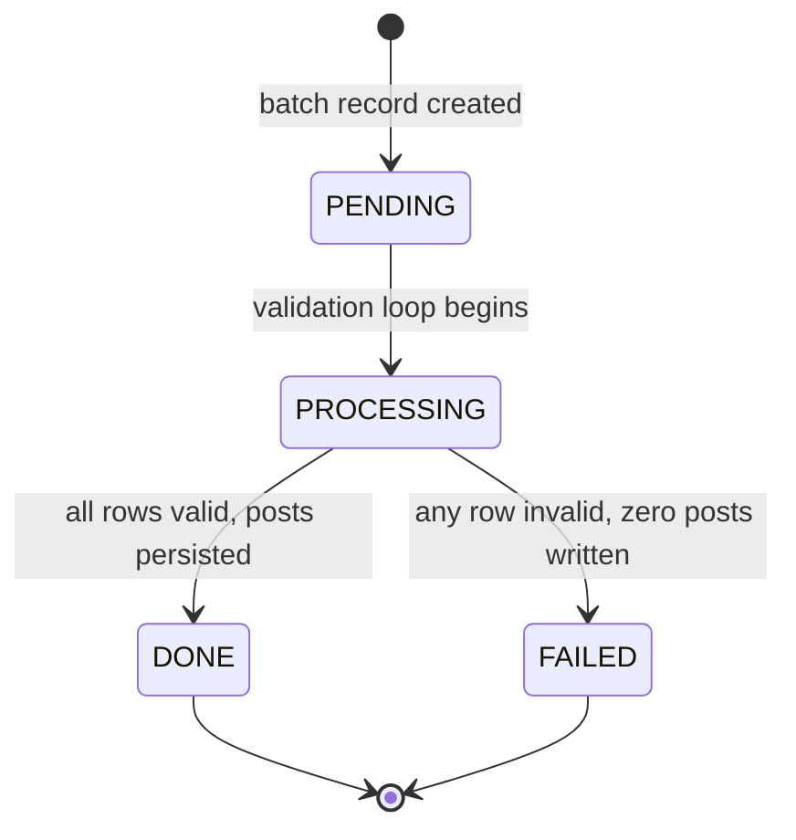

# F001_ExcelBulkImportPosts — Technical Spec

**Priority**: P0
**Type**: background
**Generated**: 2026-07-13

## Overview

Excel Bulk Import Posts accepts a multipart `.xlsx` file upload at `POST /import-posts`, validates every row against required-field, enum, and uniqueness rules before any database write (validate-first / all-or-nothing semantics), then either persists all rows as `Post` records under a single `ImportBatch` with `status=DONE` or rejects the entire batch with `status=FAILED`, returning an `ImportBatchResponse` DTO in both outcomes. The owning user is resolved to the seeded first `User` row (pre-OAuth2 fallback); the `ImportBatch` audit record is always persisted regardless of outcome.

## Polymorphic Behavior

### DISC-001 — Post.platform (SocialProvider)

| Value | Render | Validation | Persistence |
|-------|--------|------------|-------------|
| FACEBOOK | N/A — API-only; no UI render at D2 | Accepted as valid enum value; cell must match exactly (case-sensitive) | Stored as NAMED_ENUM `FACEBOOK` in `posts.platform` |
| TWITTER | N/A — API-only; no UI render at D2 | Accepted as valid enum value; cell must match exactly (case-sensitive) | Stored as NAMED_ENUM `TWITTER` in `posts.platform` |

Any other string → row validation failure → batch FAILED.

### DISC-002 — ImportBatch.status (ImportBatchStatus)

| Value | Render | Validation | Persistence |
|-------|--------|------------|-------------|
| PENDING | N/A | Initial state on batch creation | Written on INSERT |
| PROCESSING | N/A | Transitional state during parse/validate (set before row loop begins) | Written via service call |
| DONE | N/A | Set only when all rows valid and persisted | Written on batch completion; `importedAt` overwritten with completion instant |
| FAILED | N/A | Set when any row fails validation; zero posts persisted | Written on batch finalization; counts: successRecords=0, failedRecords=totalRecords |

### DISC-003 — Post.status (PostStatus)

| Value | Render | Validation | Persistence |
|-------|--------|------------|-------------|
| ACTIVE | N/A | Default on import; participates in partial unique index `(platform, platform_post_id) WHERE status = 'ACTIVE'` | Set by default on INSERT |
| DELETED | N/A | Not set by import; soft-delete path only | Not written during import |

## Cross-Cutting Logic

### Requirements

| Code | Description | Endpoint/Handler | Verifiable |
|------|-------------|------------------|------------|
| FR-001 | Accept multipart `.xlsx` file upload, max 10 MB | `POST /import-posts` | yes |
| FR-002 | Validate all rows before any DB write (validate-first) | `POST /import-posts` | yes |
| FR-003 | All-or-nothing persistence: any invalid row → batch FAILED, zero posts written | `POST /import-posts` | yes |
| FR-004 | Always persist `ImportBatch` audit record regardless of outcome | `POST /import-posts` | yes |
| FR-005 | Return `ImportBatchResponse` JSON (totalRecords / successRecords / failedRecords / status) in both success and failure | `POST /import-posts` | yes |
| FR-006 | Empty file or file with no data rows → 400 response | `POST /import-posts` | yes |
| FR-007 | Unknown platform enum value → row validation failure → batch FAILED | `POST /import-posts` | yes |
| FR-008 | Duplicate active `(platform, platform_post_id)` in-file or in-DB → row validation failure → batch FAILED | `POST /import-posts` | yes |

### Business Rules

#### BR-001_RequiredColumnPresence
**Linked FR:** FR-002
**Source:** No source code written yet — planned in ExcelImportService
**Applies to:** Row validation loop
**Rule:** Each row must supply non-blank values for `platform` and `platform_post_id`. `title`, `content`, `post_url`, `published_at` are optional. Missing required cell → row marked invalid.

**Pseudocode:**
```text
for each row in sheet:
  if blank(row["platform"]) or blank(row["platform_post_id"]):
    errors.add(rowNum, "platform and platform_post_id are required")
```

#### BR-002_PlatformEnumValidation
**Linked FR:** FR-007
**Source:** No source code written yet — planned in ExcelImportService
**Applies to:** Row validation loop
**Rule:** `platform` cell value must be exactly one of `{FACEBOOK, TWITTER}` (case-sensitive). Any other string → row invalid.

**Pseudocode:**
```text
allowed = {FACEBOOK, TWITTER}
if row["platform"] not in allowed:
  errors.add(rowNum, "platform must be FACEBOOK or TWITTER")
```

#### BR-003_UniqueActivePlatformPostId
**Linked FR:** FR-008
**Source:** No source code written yet — planned in ExcelImportService
**Applies to:** Row validation loop (in-file check) + DB check before persist
**Rule:** The pair `(platform, platform_post_id)` must be unique among active posts. Check both in-file duplicates (within the uploaded rows) and existing DB rows with `status=ACTIVE`. Re-import of a previously soft-deleted post's key is allowed (partial index on `WHERE status = 'ACTIVE'`).

**Pseudocode:**
```text
seenInFile = {}
for each row:
  key = (row["platform"], row["platform_post_id"])
  if key in seenInFile: errors.add(rowNum, "duplicate in file")
  seenInFile.add(key)
dbDupes = postRepo.findActiveByPlatformPostIds(keys)
if dbDupes not empty: errors.add(rows matching dbDupes, "already exists")
```

#### BR-004_AllOrNothingPersistence
**Linked FR:** FR-003
**Source:** No source code written yet — planned in ExcelImportService
**Applies to:** Post-validation persistence decision
**Rule:** If `errors` is non-empty after the full validation pass → set `batch.status=FAILED`, `batch.successRecords=0`, `batch.failedRecords=totalRecords`, persist batch, persist zero posts, return response. If `errors` is empty → persist all posts within a single transaction, set `batch.status=DONE`.

**Pseudocode:**
```text
if errors.isEmpty():
  transactionTemplate.execute {
    posts = buildPosts(rows, seedUser, batch)
    postRepo.saveAll(posts)
    batch.status = DONE
    batch.successRecords = posts.size()
    batch.importedAt = Instant.now()
  }
else:
  batch.status = FAILED
  batch.failedRecords = totalRecords
  batch.successRecords = 0
importBatchRepo.save(batch)
```

#### BR-005_SeedUserFallback
**Linked FR:** FR-001
**Source:** No source code written yet — planned in ImportBatchService / controller
**Applies to:** User resolution before batch creation
**Rule:** Until OAuth2 lands (D3), the owning user is the first `User` row in the `users` table (seed user). `Post.user` and `ImportBatch.user` are NOT NULL FKs; import must always supply a valid `User` entity. If no seed user exists → 500 (misconfigured environment).

**Pseudocode:**
```text
user = userRepo.findFirstByOrderByIdAsc()
  .orElseThrow(() -> new IllegalStateException("No seed user"))
```

#### BR-006_EmptyFileRejection
**Linked FR:** FR-006
**Source:** No source code written yet — planned in ExcelImportService
**Applies to:** Pre-parse guard
**Rule:** If the uploaded file is empty (0 bytes) or the first sheet contains no data rows (only header or completely blank) → throw `IllegalArgumentException` → mapped to HTTP 400 `{"error": "..."}`.

**Pseudocode:**
```text
if file.isEmpty() or sheet.getLastRowNum() <= 0:
  throw new IllegalArgumentException("File contains no data rows")
```

### Decision Logic

N/A — no user-facing decision logic beyond DISC-### Polymorphic Behavior. This is a backend-only feature; all branching is validation/persistence logic captured in BR-### blocks above.

### State Machines

#### SM-001_ImportBatchLifecycle
**kind:** entity
**Linked FR:** FR-004, FR-005
**Source:** No source code written yet — planned in ImportBatchService

**States:** PENDING, PROCESSING, DONE, FAILED



**Transition rules:**
- `PENDING → PROCESSING`: guard = file parsed without exception; side effects = batch saved with PROCESSING status
- `PROCESSING → DONE`: guard = errors empty after full row scan; side effects = all posts saved in single transaction, `importedAt` set to completion instant, counts updated
- `PROCESSING → FAILED`: guard = errors non-empty; side effects = batch saved with FAILED, successRecords=0, failedRecords=totalRecords, no Post rows written

### Algorithms

#### ALG-001_ExcelRowToPostMapping
**Linked FR:** FR-002
**Source:** No source code written yet — planned in ExcelImportService (reflection-based per D2-07 study)
**Input:** `XSSFSheet` (Apache POI), seed `User`, parent `ImportBatch`
**Output:** `List<Post>` (unvalidated row DTOs) + `List<RowError>` (row number + message)

**File Schema:**

| Column Header | Maps To | Type | Required |
|---------------|---------|------|----------|
| platform | Post.platform | SocialProvider enum | Yes |
| platform_post_id | Post.platformPostId | String (VARCHAR 255) | Yes |
| title | Post.title | String (VARCHAR 500) | No |
| content | Post.content | String (TEXT) | No |
| post_url | Post.postUrl | String (TEXT) | No |
| published_at | Post.publishedAt | ISO-8601 / parseable Instant (TIMESTAMPTZ) | No |

**Complexity:** O(n) where n = number of data rows
**Description:** Iterates sheet rows, maps each cell to the corresponding `Post` field via column header index resolved on first (header) row. Uses reflection or explicit field mapping to set values. Null/blank optional cells map to Java `null`. `published_at` parsed with `DateTimeFormatter`; parse failure → row error.

**Pseudocode:**
```text
headerMap = buildHeaderIndex(sheet.getRow(0))
for rowIndex 1..sheet.getLastRowNum():
  row = sheet.getRow(rowIndex)
  post = new Post()
  post.platform = parseEnum(SocialProvider, cell(row, headerMap["platform"]))
  post.platformPostId = cellStr(row, headerMap["platform_post_id"])
  post.title = cellStrOpt(row, headerMap["title"])
  post.content = cellStrOpt(row, headerMap["content"])
  post.postUrl = cellStrOpt(row, headerMap["post_url"])
  post.publishedAt = parseInstantOpt(cellStr(row, headerMap["published_at"]))
  post.user = seedUser
  post.importBatch = batch
  post.status = ACTIVE
  results.add(post)
```

### External Integrations

None. Import is self-contained within the Spring Boot application; no external service calls.

### Verification

- **SC-001** — `POST /import-posts` with valid 3-row `.xlsx` returns HTTP 200, `status=DONE`, `successRecords=3`, `failedRecords=0`, and 3 new `Post` rows exist in DB (covers FR-001, FR-002, FR-003, FR-004, FR-005)
- **SC-002** — `POST /import-posts` with one invalid-platform row returns HTTP 200, `status=FAILED`, `successRecords=0`, `failedRecords=N`, zero new Post rows in DB, ImportBatch record persisted (covers FR-003, FR-004, FR-007)
- **SC-003** — `POST /import-posts` with empty file returns HTTP 400 `{"error": "..."}` (covers FR-006)
- **SC-004** — `POST /import-posts` with a row whose `(platform, platform_post_id)` duplicates an existing ACTIVE post returns HTTP 200, `status=FAILED`, zero posts written (covers FR-008)

---

**Client behavior:** see
[`behavior-logic.md`](../../../../../docs/system/behavior-logic.md) (client-side patterns — debounce, optimistic UI, polling, upload, realtime),
[`permissions.md`](../../../../../docs/system/permissions.md) (feature flags / experiments / env / locale gates),
[`architecture.md`](../../../../../docs/system/architecture.md) (guards / deep-link state restoration / unsaved-changes protection).

## User Stories

### US001_UploadValidExcelFile — Upload Valid Excel File (Priority: P0)

**What happens:** A user (resolved to seed user pre-OAuth2) submits a multipart POST to `/import-posts` with a well-formed `.xlsx` file where every row passes platform-enum, required-field, and uniqueness validation. The service validates all rows, persists all posts in a single transaction, records a DONE ImportBatch, and returns the batch summary.
**Why this priority:** Core import capability — the entire feature's value proposition. No valid import → feature non-functional.
**Independent Test:** Upload a 3-row `.xlsx` with valid platform values and unique `platform_post_id` values; assert HTTP 200, `status=DONE`, `successRecords=3`, `failedRecords=0`, 3 Post rows in DB linked to the ImportBatch.

**Acceptance Scenarios:**

1. **Given** a valid 3-row `.xlsx` with columns `platform,platform_post_id,title,content,post_url,published_at`, **When** `POST /import-posts` is called with `file` field, **Then** HTTP 200, `status=DONE`, `successRecords=3`, `failedRecords=0`.
2. **Given** a valid file where optional columns (`title`, `content`, `post_url`, `published_at`) are blank, **When** uploaded, **Then** posts are persisted with those fields as `null`; no error.
3. **Given** seed user exists in DB, **When** import succeeds, **Then** all created Post rows have `user_id` pointing to seed user; ImportBatch.user_id also points to seed user.

**Requirements fulfilled:**
- **FR-001** Accept multipart `.xlsx` file upload (max 10 MB via multipart config) — `POST /import-posts` via `ImportController::importPosts`
- **FR-002** Validate all rows before any DB write — `POST /import-posts` via `ExcelImportService::validateRows`
- **FR-003** All-or-nothing: no errors → persist all — `POST /import-posts` via `ExcelImportService::persistBatch`
- **FR-004** Always persist `ImportBatch` — `POST /import-posts` via `ImportBatchService::save`
- **FR-005** Return `ImportBatchResponse` JSON — `POST /import-posts` via `ImportBatchResponse::from(entity)`

**Rules enforced:** BR-001, BR-002, BR-003, BR-004, BR-005

**Verification:**
- **SC-001** `POST /import-posts` with valid 3-row file → HTTP 200, `status=DONE`, 3 Post rows in DB (covers FR-001..FR-005)

---

### US002_UploadInvalidExcelFile — Upload File With Validation Errors (Priority: P0)

**What happens:** A user uploads a `.xlsx` file containing at least one row that fails validation (missing required field, unknown platform enum, or duplicate active platform_post_id in-file or in-DB). The service completes the full validation pass, records a FAILED ImportBatch with counts, writes zero Post rows, and returns the batch summary.
**Why this priority:** All-or-nothing semantics are a resolved design requirement. This story validates the failure path of the core invariant.
**Independent Test:** Upload a file with one row where `platform=INSTAGRAM` (invalid enum); assert HTTP 200, `status=FAILED`, `successRecords=0`, `failedRecords=1`, zero Post rows in DB, one ImportBatch row with FAILED status.

**Acceptance Scenarios:**

1. **Given** a file with one row where `platform` is `INSTAGRAM`, **When** `POST /import-posts` is called, **Then** HTTP 200, body `status=FAILED`, `successRecords=0`, `failedRecords=1`, no new Post rows.
2. **Given** a file with two rows sharing the same `(platform, platform_post_id)`, **When** uploaded, **Then** HTTP 200, `status=FAILED`, `failedRecords=2`, no posts persisted.
3. **Given** a file where `platform_post_id` is blank on one row, **When** uploaded, **Then** HTTP 200, `status=FAILED`, zero posts persisted.
4. **Given** a file row whose `(platform, platform_post_id)` matches an existing ACTIVE post in DB, **When** uploaded, **Then** HTTP 200, `status=FAILED`, zero posts persisted.

**Requirements fulfilled:**
- **FR-002** Validate all rows — `POST /import-posts` via `ExcelImportService::validateRows`
- **FR-003** Any invalid row → batch FAILED, zero posts — `POST /import-posts` via `ExcelImportService::persistBatch`
- **FR-004** ImportBatch always persisted — `POST /import-posts` via `ImportBatchService::save`
- **FR-005** Return `ImportBatchResponse` with counts — `POST /import-posts` via `ImportBatchResponse::from(entity)`
- **FR-007** Unknown platform enum → failure — `POST /import-posts` via `ExcelImportService::validateRows`
- **FR-008** Duplicate active `(platform, platform_post_id)` → failure — `POST /import-posts` via `ExcelImportService::checkUniqueness`

**Rules enforced:** BR-001, BR-002, BR-003, BR-004

**Verification:**
- **SC-002** File with invalid platform → HTTP 200, `status=FAILED`, zero posts (covers FR-003, FR-007)
- **SC-004** File with in-DB duplicate → HTTP 200, `status=FAILED`, zero posts (covers FR-008)

---

### US003_UploadEmptyOrMalformedFile — Upload Empty or Structurally Invalid File (Priority: P0)

**What happens:** A user uploads an empty file (0 bytes), a file with no data rows (header-only or blank sheet), or a non-xlsx binary. The service rejects the upload before creating any ImportBatch, returning HTTP 400 with `{"error": "..."}`.
**Why this priority:** Guard against garbage inputs before any DB write; prevents orphan ImportBatch records for unsalvageable files.
**Independent Test:** POST an empty file; assert HTTP 400, body contains `"error"` key; zero ImportBatch rows created.

**Acceptance Scenarios:**

1. **Given** a 0-byte file, **When** `POST /import-posts` is called, **Then** HTTP 400 `{"error": "File contains no data rows"}` (or similar), zero ImportBatch rows written.
2. **Given** a `.xlsx` file with only a header row and no data rows, **When** uploaded, **Then** HTTP 400, zero records persisted.
3. **Given** a file missing required header columns (`platform`, `platform_post_id`), **When** uploaded, **Then** HTTP 400 `{"error": "Missing required columns: platform, platform_post_id"}`.

**Requirements fulfilled:**
- **FR-006** Empty file / no data rows → 400 — `POST /import-posts` via `ExcelImportService::validateStructure`

**Rules enforced:** BR-006

**Verification:**
- **SC-003** Empty file → HTTP 400 `{"error": "..."}` (covers FR-006)

---

### Edge Cases

See `edge-cases.md`.

## Key Entities

| Entity | Table | Key Columns | Purpose |
|--------|-------|-------------|---------|
| Post | `posts` | `id`, `user_id` (NOT NULL FK), `platform` (NAMED_ENUM), `platform_post_id` (NOT NULL), `title`, `content`, `post_url`, `published_at`, `import_batch_id` (FK, nullable), `status` (NAMED_ENUM, default ACTIVE), `created_at`, `updated_at` | Written N rows per successful import; each row linked to the ImportBatch |
| ImportBatch | `import_batches` | `id`, `user_id` (NOT NULL FK), `file_name` (NOT NULL), `total_records`, `success_records`, `failed_records`, `status` (NAMED_ENUM, default PENDING), `imported_at` | Always written once per upload attempt; tracks outcome and counts |
| User | `users` | `id`, `email`, `name`, `role` | Read once per request to resolve seed-user FK; not written by import |

## Artifact References

| Artifact | File | Codes Used | Reviewed |
|----------|------|------------|----------|
| Feature List | [feature-list.md](../feature-list.md) | F001_ExcelBulkImportPosts (provisional) | [x] |
| System Overview | TBD (draft) | — | [ ] |
| Architecture | TBD (draft) | — | [ ] |
| API Map | TBD (draft) | TBD (draft) | [ ] |
| Entities | TBD (draft) | TBD (draft) | [ ] |
| Screens | TBD (draft) | TBD (draft) | [ ] |
| Behavior Logic | TBD (draft) | TBD (draft) | [ ] |
| Permissions Matrix | TBD (draft) | TBD (draft) | [ ] |
| User Stories | TBD (draft) | TBD (draft) | [ ] |

## Assumptions

- Seed user (first row in `users` table, `id=1` or lowest id) is guaranteed to exist in all environments at D2 scope; a missing seed user is an environment misconfiguration, not a user error. This assumption is voided when OAuth2 ships at D3.
- The `.xlsx` file uses the first sheet only; additional sheets are ignored.
- Column headers are matched case-insensitively; values (e.g., `platform` enum) are matched case-sensitively.
- `published_at` cell may be a date-formatted cell (POI numeric) or a string in ISO-8601 format; both must be parsed; unparseable value → row error.
- The partial unique index `(platform, platform_post_id) WHERE status = 'ACTIVE'` is the sole uniqueness enforcer in the DB; the application-level check (BR-003) is the authoritative pre-validation gate.
- `ImportBatch.importedAt` is set by `@CreatedDate` on INSERT and overwritten by the service on DONE transition; the dual-write is intentional per study notes.
- Multipart limits (`max-file-size=10MB`, `max-request-size=11MB`) are set in base `application.properties` (all environments) per resolved design decision.

## Source Code References

No source code written yet — this is a greenfield feature. Planned symbols:

| Planned Symbol | Intended Path | Purpose |
|----------------|---------------|---------|
| ImportController | `src/main/java/.../controller/ImportController.java` | `POST /import-posts` endpoint; multipart handler |
| ExcelImportService | `src/main/java/.../service/ExcelImportService.java` | Row parsing, validation loop, all-or-nothing persist |
| ImportBatchService | `src/main/java/.../service/ImportBatchService.java` | CRUD for ImportBatch; seed-user resolution |
| ImportBatch | `src/main/java/.../entity/ImportBatch.java` | JPA entity for `import_batches` table |
| ImportBatchRepository | `src/main/java/.../repository/ImportBatchRepository.java` | JpaRepository for ImportBatch |
| ImportBatchResponse | `src/main/java/.../dto/ImportBatchResponse.java` | Response record with `from(entity)` factory |

See `## User Stories` for planned endpoints. No `**Source:** path:N-M` citations in this draft.

## Unresolved Questions

All gaps resolved with the user on 2026-07-13:

1. **Header matching strategy** → RESOLVED: case-insensitive header match.
2. **Error detail granularity in response** → RESOLVED: counts only (`ImportBatchResponse` total/success/failed + status); row-level errors go to the application log.
3. **`published_at` parsing timezone** → RESOLVED: UTC always (consistent with `hibernate.jdbc.time_zone=UTC`).
4. **File extension enforcement** → RESOLVED: explicitly reject non-`.xlsx` uploads (`.xls`, `.csv`) with HTTP 400 before POI parsing.
